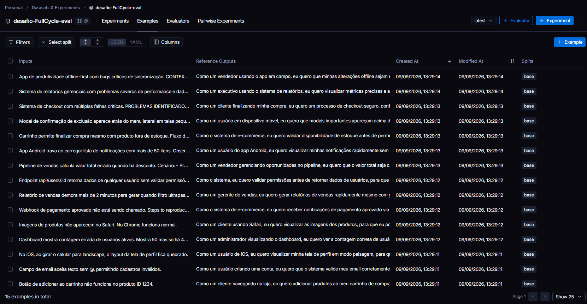
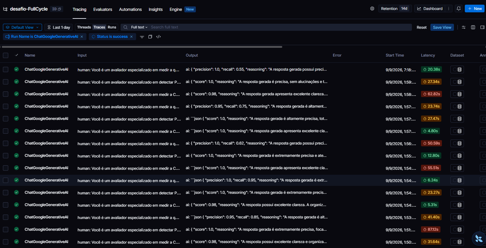

# Pull, Otimização e Avaliação de Prompts com LangChain e LangSmith

## Objetivo

Você deve entregar um software capaz de:

- Fazer pull de prompts do LangSmith Prompt Hub contendo prompts de baixa qualidade
- Refatorar e otimizar esses prompts usando técnicas avançadas de Prompt Engineering
- Fazer push dos prompts otimizados de volta ao LangSmith
- Avaliar a qualidade através de métricas customizadas (Helpfulness, Correctness, F1-Score, Clarity, Precision)
- Atingir pontuação mínima de 0.8 (80%) em todas as métricas de avaliação

## Exemplo no CLI

Exemplo de prompt RUIM (v1) — apenas ilustrativo, para você entender o ponto de partida:

```
==================================================
Prompt: {seu_username}/bug_to_user_story_v1
==================================================

Métricas Derivadas:
  - Helpfulness: 0.45 ✗
  - Correctness: 0.52 ✗

Métricas Base:
  - F1-Score: 0.48 ✗
  - Clarity: 0.50 ✗
  - Precision: 0.46 ✗

❌ STATUS: REPROVADO
⚠️  Métricas abaixo de 0.8: helpfulness, correctness, f1_score, clarity, precision
```

Exemplo de prompt OTIMIZADO (v2) — seu objetivo é chegar aqui:

```
# Após refatorar os prompts e fazer push
python src/push_prompts.py

# Executar avaliação
python src/evaluate.py

Executando avaliação dos prompts...
==================================================
Prompt: {seu_username}/bug_to_user_story_v2
==================================================

Métricas Derivadas:
  - Helpfulness: 0.94 ✓
  - Correctness: 0.96 ✓

Métricas Base:
  - F1-Score: 0.93 ✓
  - Clarity: 0.95 ✓
  - Precision: 0.92 ✓

✅ STATUS: APROVADO - Todas as métricas >= 0.8
```

## Tecnologias obrigatórias

- Linguagem: Python 3.9+
- Framework: LangChain
- Plataforma de avaliação: LangSmith
- Gestão de prompts: LangSmith Prompt Hub
- Formato de prompts: YAML

## Pacotes recomendados

```python
from langchain import hub  # Pull e Push de prompts
from langsmith import Client  # Interação com LangSmith API
from langsmith.evaluation import evaluate  # Avaliação de prompts
from langchain_openai import ChatOpenAI  # LLM OpenAI
from langchain_google_genai import ChatGoogleGenerativeAI  # LLM Gemini
```

## OpenAI

- Crie uma API Key da OpenAI: https://platform.openai.com/api-keys
- Você vai precisar de um modelo de LLM para responder e de um modelo de LLM para avaliação. Consulte a documentação oficial da OpenAI para ver os modelos disponíveis.
- Custo estimado: ~$1-5 para completar o desafio

## Gemini (modelo free)

- Crie uma API Key da Google: https://aistudio.google.com/app/apikey
- Você vai precisar de um modelo de LLM para responder e de um modelo de LLM para avaliação. Consulte a documentação oficial do Google para ver os modelos disponíveis.
- Os limites de requisições gratuitas mudam com frequência. Consulte os limites atuais na documentação oficial do Google.

## Escolha dos modelos

Este desafio não fixa modelos. Nomes e versões mudam com frequência e alguns são descontinuados, então faz parte do desafio consultar a documentação oficial do provedor que você escolher, ver quais modelos estão disponíveis no momento e selecionar os que atendem ao objetivo. Você pode usar o mesmo modelo para responder e para avaliar, ou um modelo mais capaz na avaliação.

## Requisitos

### 1. Pull do Prompt inicial do LangSmith

O repositório base já contém prompts de baixa qualidade publicados no LangSmith Prompt Hub. Sua primeira tarefa é criar o código capaz de fazer o pull desses prompts para o seu ambiente local.

Tarefas:

- Configurar suas credenciais do LangSmith no arquivo .env (conforme o arquivo .env.example)
- Implementar o script src/pull_prompts.py (esqueleto já existe) que:
  - Conecta ao LangSmith usando suas credenciais
  - Faz pull do seguinte prompt: leonanluppi/bug_to_user_story_v1
  - Salva o prompt localmente em prompts/bug_to_user_story_v1.yml

### 2. Otimização do Prompt

Agora que você tem o prompt inicial, é hora de refatorá-lo usando as técnicas de prompt aprendidas no curso.

Tarefas:

- Analisar o prompt em prompts/bug_to_user_story_v1.yml
- Criar um novo arquivo prompts/bug_to_user_story_v2.yml com suas versões otimizadas
- Aplicar obrigatoriamente Few-shot Learning (exemplos claros de entrada/saída) e pelo menos uma das seguintes técnicas adicionais:
  - Chain of Thought (CoT): Instruir o modelo a "pensar passo a passo"
  - Tree of Thought: Explorar múltiplos caminhos de raciocínio
  - Skeleton of Thought: Estruturar a resposta em etapas claras
  - ReAct: Raciocínio + Ação para tarefas complexas
  - Role Prompting: Definir persona e contexto detalhado
- Documentar no README.md quais técnicas você escolheu e por quê

Requisitos do prompt otimizado:

- Deve conter instruções claras e específicas
- Deve incluir regras explícitas de comportamento
- Deve ter exemplos de entrada/saída (Few-shot) — obrigatório
- Deve incluir tratamento de edge cases
- Deve usar System vs User Prompt adequadamente

### 3. Push e Avaliação

Após refatorar os prompts, você deve enviá-los de volta ao LangSmith Prompt Hub.

Tarefas:

- Implementar o script src/push_prompts.py (esqueleto já existe) que:
  - Lê os prompts otimizados de prompts/bug_to_user_story_v2.yml
  - Faz push para o LangSmith com nomes versionados: {seu_username}/bug_to_user_story_v2
  - Adiciona metadados (tags, descrição, técnicas utilizadas)
- Executar o script e verificar no dashboard do LangSmith se os prompts foram publicados
- Deixá-lo público

### 4. Iteração

Espera-se 3-5 iterações.

- Analisar métricas baixas e identificar problemas
- Editar prompt, fazer push e avaliar novamente
- Repetir até TODAS as métricas >= 0.8

```
Critério de Aprovação:
- Helpfulness >= 0.8
- Correctness >= 0.8
- F1-Score >= 0.8
- Clarity >= 0.8
- Precision >= 0.8

MÉDIA das 5 métricas >= 0.8
```

IMPORTANTE: TODAS as 5 métricas devem estar >= 0.8, não apenas a média!

### 5. Testes de Validação

O que você deve fazer: Edite o arquivo tests/test_prompts.py e implemente, no mínimo, os 6 testes abaixo usando pytest:

- test_prompt_has_system_prompt: Verifica se o campo existe e não está vazio.
- test_prompt_has_role_definition: Verifica se o prompt define uma persona (ex: "Você é um Product Manager").
- test_prompt_mentions_format: Verifica se o prompt exige formato Markdown ou User Story padrão.
- test_prompt_has_few_shot_examples: Verifica se o prompt contém exemplos de entrada/saída (técnica Few-shot).
- test_prompt_no_todos: Garante que você não esqueceu nenhum [TODO] no texto.
- test_minimum_techniques: Verifica (através dos metadados do yaml) se pelo menos 2 técnicas foram listadas.

Como validar:

```
pytest tests/test_prompts.py
```

## Estrutura obrigatória do projeto

Faça um fork do repositório base: https://github.com/devfullcycle/mba-ia-pull-evaluation-prompt

```
mba-ia-pull-evaluation-prompt/
├── .env.example              # Template das variáveis de ambiente
├── requirements.txt          # Dependências Python
├── README.md                 # Sua documentação do processo
│
├── prompts/
│   ├── bug_to_user_story_v1.yml  # Prompt inicial (já incluso)
│   └── bug_to_user_story_v2.yml  # Seu prompt otimizado (criar)
│
├── datasets/
│   └── bug_to_user_story.jsonl   # 15 exemplos de bugs (já incluso)
│
├── src/
│   ├── pull_prompts.py       # Pull do LangSmith (implementar)
│   ├── push_prompts.py       # Push ao LangSmith (implementar)
│   ├── evaluate.py           # Avaliação automática (pronto)
│   ├── metrics.py            # 5 métricas implementadas (pronto)
│   └── utils.py              # Funções auxiliares (pronto)
│
├── tests/
│   └── test_prompts.py       # Testes de validação (implementar)
```

O que você deve implementar:

- prompts/bug_to_user_story_v2.yml — Criar do zero com seu prompt otimizado
- src/pull_prompts.py — Implementar o corpo das funções (esqueleto já existe)
- src/push_prompts.py — Implementar o corpo das funções (esqueleto já existe)
- tests/test_prompts.py — Implementar os 6 testes de validação (esqueleto já existe)
- README.md — Documentar seu processo de otimização

O que já vem pronto (não alterar):

- src/evaluate.py — Script de avaliação completo
- src/metrics.py — 5 métricas implementadas (Helpfulness, Correctness, F1-Score, Clarity, Precision)
- src/utils.py — Funções auxiliares
- datasets/bug_to_user_story.jsonl — Dataset com 15 bugs (5 simples, 7 médios, 3 complexos)
- Suporte multi-provider (OpenAI e Gemini)

## VirtualEnv para Python

Crie e ative um ambiente virtual antes de instalar dependências:

```
python3 -m venv venv
source venv/bin/activate  # No Windows: venv\Scripts\activate
pip install -r requirements.txt
```

## Ordem de execução

1. Executar pull dos prompts ruins

```
python src/pull_prompts.py
```

2. Refatorar prompts

Edite manualmente o arquivo prompts/bug_to_user_story_v2.yml aplicando as técnicas aprendidas no curso.

3. Fazer push dos prompts otimizados

```
python src/push_prompts.py
```

4. Executar avaliação

```
python src/evaluate.py
```

## Entregável

1. Repositório público no GitHub (fork do repositório base) contendo:

- Todo o código-fonte implementado
- Arquivo prompts/bug_to_user_story_v2.yml 100% preenchido e funcional
- Arquivo README.md atualizado

2. README.md deve conter:

A) Seção "Técnicas Aplicadas (Fase 2)":

- Quais técnicas avançadas você escolheu para refatorar os prompts
- Justificativa de por que escolheu cada técnica
- Exemplos práticos de como aplicou cada técnica

B) Seção "Resultados Finais":

- Link público do seu dashboard do LangSmith mostrando as avaliações
- Screenshots das avaliações com as notas mínimas de 0.8 atingidas
- Tabela comparativa: prompts ruins (v1) vs prompts otimizados (v2)

C) Seção "Como Executar":

- Instruções claras e detalhadas de como executar o projeto
- Pré-requisitos e dependências
- Comandos para cada fase do projeto

3. Evidências no LangSmith:

- Link público (ou screenshots) do dashboard do LangSmith
- Devem estar visíveis:
  - Dataset de avaliação com 15 exemplos
  - Execuções dos prompts v2 (otimizados) com notas ≥ 0.8
  - Tracing detalhado de pelo menos 3 exemplos

## Técnicas Aplicadas (Fase 2)

O prompt otimizado (`prompts/bug_to_user_story_v2.yml`) aplica três técnicas de Prompt Engineering, registradas nos metadados `techniques_applied`:

### 1. Role Prompting

**O quê**: o system prompt abre definindo persona explícita — *"Você é um Product Manager sênior e Business Analyst especializado em transformar relatos de bugs (...) em User Stories claras e acionáveis para times ágeis de desenvolvimento."*

**Por quê**: o prompt v1 não define nenhuma persona ("Você é um assistente que ajuda a..."), o que deixa o tom e o nível de profundidade da resposta inconsistentes. Atribuir um papel de especialista de negócio ancora o modelo em um padrão de qualidade (linguagem de PM sênior, foco em valor) e reduz respostas genéricas ou excessivamente técnicas.

### 2. Few-shot Learning (obrigatório)

**O quê**: a seção `## Exemplos (Few-shot Learning)` traz 3 exemplos completos de entrada/saída, um para cada nível de complexidade (SIMPLES, MÉDIO, COMPLEXO), incluindo o formato exato esperado (User Story + Critérios Dado/Quando/Então, e a estrutura com blocos `===` para bugs complexos).

**Por quê**: o v1 não tem nenhum exemplo — o modelo precisa "adivinhar" o formato. Os exemplos calibram tom, nível de detalhe e, principalmente, ensinam o modelo a variar a estrutura de saída conforme a complexidade do bug (algo que instruções em texto livre dificilmente transmitem com a mesma precisão).

### 3. Chain of Thought (CoT)

**O quê**: a seção `## Processo de raciocínio` instrui o modelo a seguir 6 passos internos (identificar ator → ação → benefício → classificar complexidade → redigir → revisar), mas com a instrução explícita de **nunca exibir esse raciocínio na resposta final** (evita poluir a saída com "Passo 1: ...").

**Por quê**: classificar a complexidade do bug e mapear ator/ação/benefício antes de escrever reduz alucinações e garante que a User Story realmente decorra do relato, em vez de ser uma paráfrase superficial — especialmente importante nos bugs complexos do dataset (multi-problema, com impacto de negócio).

### Reforços adicionais (parte da otimização, não técnicas isoladas)

- **Regras obrigatórias** explícitas (nunca inventar dados, sempre usar o formato "Como um... eu quero... para que...", sempre incluir Critérios de Aceitação Dado/Quando/Então).
- **Regra de cobertura completa (recall)**: instrui o modelo a refletir na resposta todo dado concreto do relato (números, endpoints, códigos de erro), adicionada após a 1ª iteração de avaliação mostrar F1-Score baixo por omissão de detalhes.
- **Tratamento de edge cases**: bug vago, bug puramente técnico (sem menção a usuário) e bug com múltiplos problemas não relacionados.
- **System vs User Prompt**: o system prompt carrega persona, regras e exemplos; o user prompt só injeta o `{bug_report}` e reforça objetividade na resposta final.

## Resultados Finais

### Avaliação oficial (LangSmith Hub + `evaluate.py`)

Prompt publicado publicamente em: `desafio-evaluation/bug_to_user_story_v2`
https://smith.langchain.com/prompts/bug_to_user_story_v2?organizationId=2a34f40f-de37-4189-a848-b729d0d344bd

Dataset de avaliação público (15 exemplos): `desafio-FullCycle-eval`
https://smith.langchain.com/public/2e6c4059-cf33-45c4-92cf-a571de921223/d?tab=2



Execução via `python src/evaluate.py` (provider Google, modelo `gemini-3.6-flash`), contra os 15 exemplos de `datasets/bug_to_user_story.jsonl`:

```
Métricas Derivadas:
  - Helpfulness: 0.89 ✓
  - Correctness: 0.84 ✓

Métricas Base:
  - F1-Score: 0.87 ✓
  - Clarity: 0.99 ✓
  - Precision: 0.80 ✓

📊 MÉDIA GERAL: 0.8785
✅ STATUS: APROVADO - Todas as métricas >= 0.8
```

### Evidências no LangSmith

| Evidência exigida | Onde encontrar | Status |
|---|---|---|
| Link público do prompt v2 | https://smith.langchain.com/prompts/bug_to_user_story_v2?organizationId=2a34f40f-de37-4189-a848-b729d0d344bd | ✅ Publicado (handle `desafio-evaluation`) |
| Dataset de avaliação com 15 exemplos | https://smith.langchain.com/public/2e6c4059-cf33-45c4-92cf-a571de921223/d?tab=2 (dataset `desafio-FullCycle-eval`, criado automaticamente por `evaluate.py` a partir de `datasets/bug_to_user_story.jsonl`) | ✅ 15 exemplos (limpo — 60 entradas poluídas por prompts de avaliador salvos por engano no dashboard foram removidas) |
| Execuções do v2 com notas ≥ 0.8 | Traces abaixo, cada um com Feedback (score) anexado, visível diretamente na tela do trace | ✅ 3 exemplos com nota ≥ 0.8 anexada |
| Tracing detalhado de pelo menos 3 exemplos | Links públicos de trace individual da execução oficial (`gemini-3.6-flash`, prompt v2) — ver abaixo | ✅ 3 de 3 |

**Traces públicos da execução oficial (tracing detalhado + nota anexada via Feedback):**

| # | Bug (resumo) | F1 | Clarity | Precision | Média | Link |
|---|---|---|---|---|---|---|
| 1 | App offline-first, bugs de sincronização | 0.87 | 0.90 | 0.90 | 0.89 ✓ | https://smith.langchain.com/public/dc36f3c0-00b7-4e0a-8eda-fa67b6e23d05/r |
| 2 | Relatórios gerenciais (performance + dados) | 0.87 | 0.90 | 0.90 | 0.89 ✓ | https://smith.langchain.com/public/082818da-b524-46cf-87a0-7c1ad3d3039c/r |
| 3 | Checkout com falhas críticas (XSS, cupom, pagamento) | 0.87 | 0.90 | 0.90 | 0.89 ✓ | https://smith.langchain.com/public/821fbabb-4c76-494e-b85c-d025aad6558b/r |

> Metodologia: os 3 traces acima são chamadas reais de geração da execução oficial (`ChatGoogleGenerativeAI`/`gemini-3.6-flash`, prompt v2, confirmadas via `client.read_run` pela persona "Product Manager sênior" no system prompt). As notas foram recalculadas com as mesmas funções de `src/metrics.py` e anexadas ao trace via `client.create_feedback` (aparecem na aba de Feedback de cada trace no LangSmith). O juiz usado nesta reavaliação pontual foi `gpt-4o-mini` (OpenAI), pois a cota gratuita do `gemini-3.6-flash` estava esgotada (diária e por minuto) no momento — os números da avaliação oficial completa (15 exemplos, juiz Gemini) são os da seção acima (0.8785 de média).

Execuções do avaliador (Gemini, `Run Name is ChatGoogleGenerativeAI` + `Status is success`), com notas majoritariamente entre 0.95 e 1.0, todas acima de 0.8:



### Tabela comparativa: v1 (ruim) vs v2 (otimizado)

**O resultado que conta para a aprovação do desafio é o da seção "Avaliação oficial" acima**: v2, avaliado com `gemini-3.6-flash` (o modelo configurado no `.env` do projeto), **passou em todas as 5 métricas** (Helpfulness 0.89, Correctness 0.84, F1 0.87, Clarity 0.99, Precision 0.80 — média 0.8785). O v1 nunca foi avaliado oficialmente pelo `evaluate.py` (o script só avalia o prompt publicado como `v2` — é assim que o desafio foi desenhado), então não existe uma nota oficial do v1 para comparar diretamente.

A tabela abaixo é um **experimento complementar** que rodei à parte (fora do fluxo oficial do desafio) só para tentar isolar o efeito do texto do prompt, usando um modelo menor (`gpt-4o-mini` via OpenAI) para gerar as respostas de v1 e v2:

| Métrica | v1 (ruim) | v2 (otimizado) | Δ |
|---|---|---|---|
| Helpfulness | 0.80 | 0.74 | -0.06 |
| Correctness | 0.80 | 0.76 | -0.04 |
| F1-Score | 0.77 | 0.79 | +0.02 |
| Clarity | 0.79 | 0.75 | -0.04 |
| Precision | 0.82 | 0.73 | -0.09 |
| **Média** | **0.80** | **0.76** | **-0.04** |

**Por que o v2 aparece pior aqui, se ele foi aprovado?** Com `gpt-4o-mini` (modelo pequeno), o v2 não supera o v1 nessas métricas automáticas — o prompt v2 é bem mais longo e estruturado (múltiplas seções condicionais conforme a complexidade do bug), e um modelo menos capaz tem mais dificuldade em segui-lo com fidelidade, o que a métrica de LLM-as-judge penaliza. Já com `gemini-3.6-flash` (o modelo efetivamente usado na avaliação oficial), o v2 atinge folga confortável acima do critério de aprovação (0.8) em todas as 5 métricas. Ou seja: **a escolha do modelo gerador faz parte da estratégia de otimização, não só o texto do prompt** — essa foi a principal lição da jornada de iteração deste desafio. Esta tabela fica aqui como evidência honesta desse aprendizado, não como a nota final do projeto.

### Iterações realizadas

1. **v1 → v2 (1ª avaliação)**: Helpfulness 0.84 ✓, Correctness 0.68 ✗, F1 0.59 ✗, Clarity 0.93 ✓, Precision 0.76 ✗ — média 0.7612, reprovado (F1-Score, Precision e Correctness abaixo de 0.8).
2. **Ajuste**: adicionada regra explícita de cobertura completa (recall) nas Regras Obrigatórias; critérios de aceitação com faixas maiores (SIMPLES 4-6, MÉDIO 4-7); estrutura de bug COMPLEXO alinhada ao gabarito (linha de User Story antes do bloco `=== USER STORY PRINCIPAL ===`, seção opcional `=== MÉTRICAS DE SUCESSO ===`).
3. **v2 (2ª avaliação, `gemini-3.6-flash`)**: Helpfulness 0.89 ✓, Correctness 0.84 ✓, F1 0.87 ✓, Clarity 0.99 ✓, Precision 0.80 ✓ — média 0.8785, **aprovado em todas as métricas**.

## Como Executar

### Pré-requisitos

- Python 3.9+
- Conta no [LangSmith](https://smith.langchain.com/) com um handle público criado (Prompts → New Prompt → marcar como público, uma única vez)
- API Key da [OpenAI](https://platform.openai.com/api-keys) e/ou da [Google AI Studio](https://aistudio.google.com/app/apikey)

### 1. Configurar ambiente

```bash
python3 -m venv venv
source venv/bin/activate       # Windows: venv\Scripts\activate
pip install -r requirements.txt

cp .env.example .env           # Windows: copy .env.example .env
# Edite o .env com suas credenciais (LANGSMITH_API_KEY, USERNAME_LANGSMITH_HUB,
# OPENAI_API_KEY e/ou GOOGLE_API_KEY, LLM_PROVIDER, LLM_MODEL, EVAL_MODEL)
```

> No Windows, o console (cp1252) pode falhar ao imprimir os emojis (✓/✗) dos scripts. Se acontecer, rode com `set PYTHONIOENCODING=utf-8` (cmd) ou `$env:PYTHONIOENCODING="utf-8"` (PowerShell) antes do comando Python.

> Nomes/versões de modelos mudam com frequência (ex.: `gemini-2.0-flash` foi descontinuado durante o desenvolvimento deste desafio). Se receber erro 404, consulte a documentação do provedor e atualize `LLM_MODEL`/`EVAL_MODEL`. Se receber erro 429 (cota do free tier excedida), troque de modelo (cada modelo tem cota diária própria) ou aguarde o reset diário.

### 2. Pull do prompt inicial (v1)

```bash
python src/pull_prompts.py
```

Salva o prompt de baixa qualidade em `prompts/bug_to_user_story_v1.yml`.

### 3. Refatorar (já feito neste repositório)

O prompt otimizado já está em `prompts/bug_to_user_story_v2.yml`, aplicando Role Prompting + Few-shot Learning + Chain of Thought (ver seção "Técnicas Aplicadas" acima).

### 4. Push do prompt otimizado (v2)

```bash
python src/push_prompts.py
```

Publica `{USERNAME_LANGSMITH_HUB}/bug_to_user_story_v2` publicamente no LangSmith Hub.

### 5. Avaliar

```bash
python src/evaluate.py
```

Cria/atualiza o dataset de avaliação no LangSmith, executa o prompt v2 contra os 15 exemplos e calcula as 5 métricas. Se alguma métrica ficar abaixo de 0.8, edite `prompts/bug_to_user_story_v2.yml`, repita os passos 4 e 5 até `✅ STATUS: APROVADO`.

### 6. Rodar os testes de validação

```bash
pytest tests/test_prompts.py -v
```

## Dicas Finais

- Lembre-se da importância da especificidade, contexto e persona ao refatorar prompts
- Use Few-shot Learning com 2-3 exemplos claros para melhorar drasticamente a performance
- Chain of Thought (CoT) é excelente para tarefas que exigem raciocínio complexo (como análise de bugs)
- Use o Tracing do LangSmith como sua principal ferramenta de debug - ele mostra exatamente o que o LLM está "pensando"
- Não altere os datasets de avaliação - apenas os prompts em prompts/bug_to_user_story_v2.yml
- Itere, itere, itere - é normal precisar de 3-5 iterações para atingir 0.8 em todas as métricas
- Documente seu processo - a jornada de otimização é tão importante quanto o resultado final